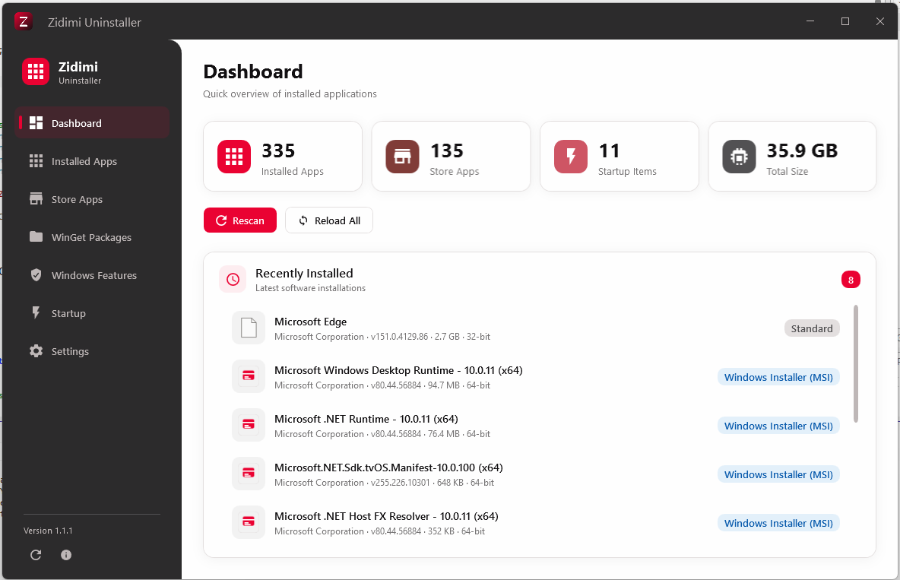
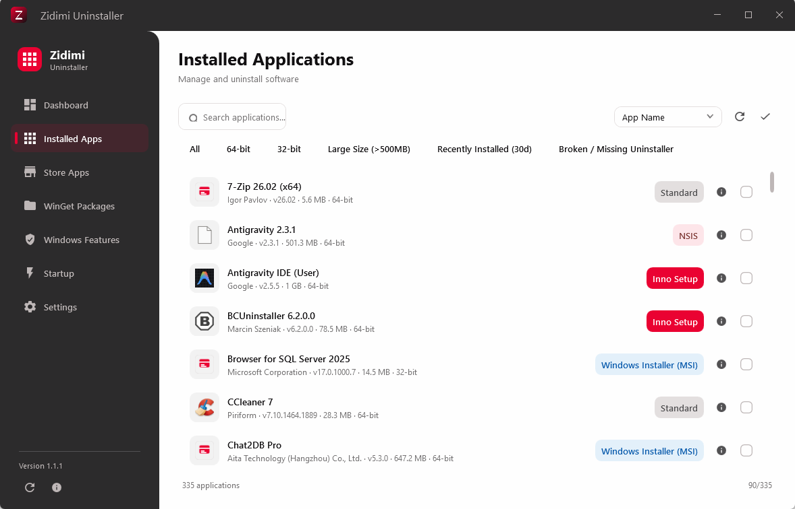
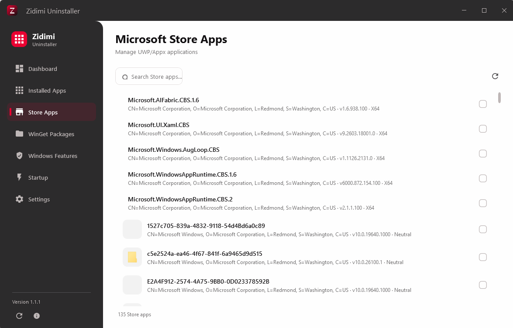
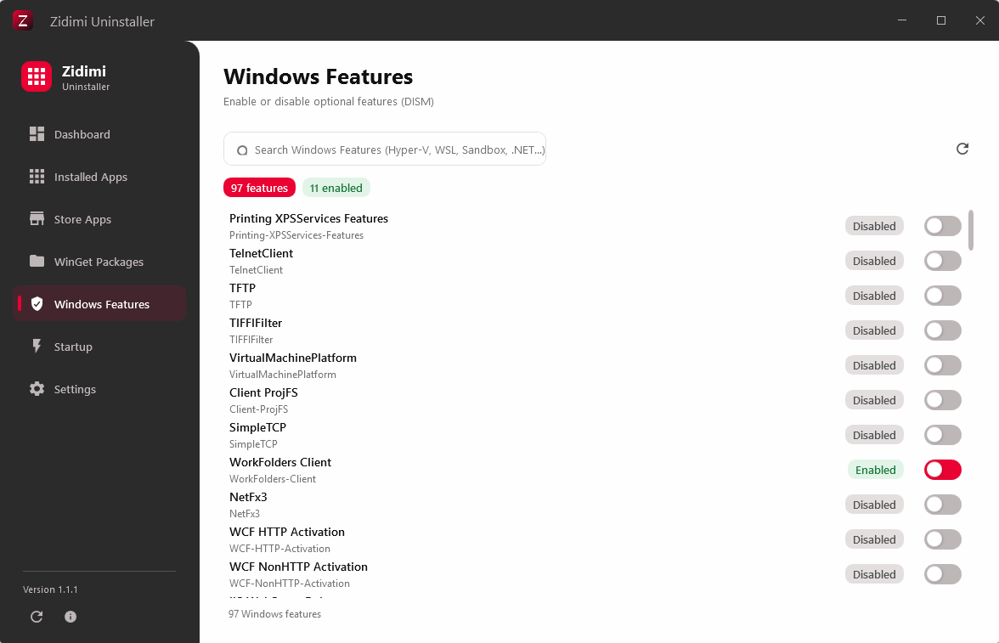
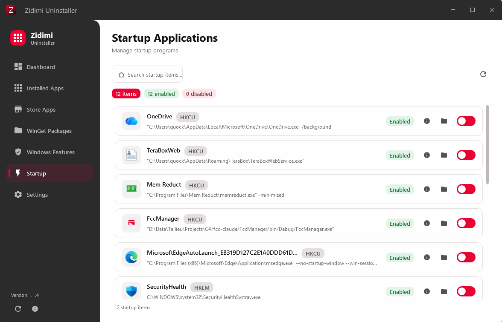
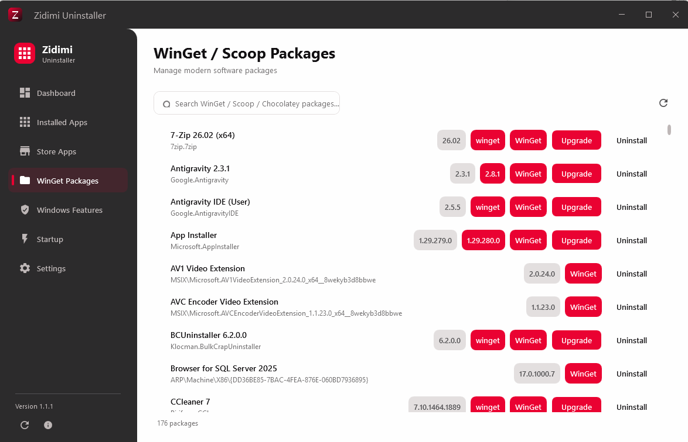
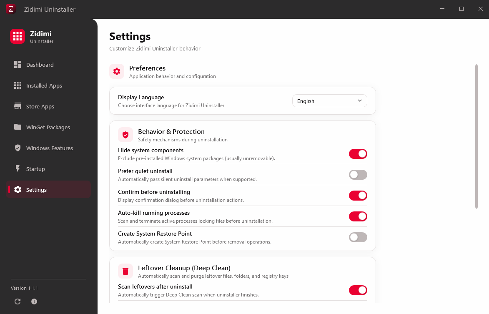

# Zidimi Uninstaller

A modern, fast, and thorough software management and uninstallation utility for Windows.

[](https://github.com/khanh779-9/zidimi-uninstaller/releases)
[](LICENSE)
[](https://github.com/khanh779-9/zidimi-uninstaller)
[](https://dotnet.microsoft.com/)

[Download Latest Release (v1.1.4)](https://github.com/khanh779-9/zidimi-uninstaller/releases/latest) | [View Releases](https://github.com/khanh779-9/zidimi-uninstaller/releases) | [Report an Issue](https://github.com/khanh779-9/zidimi-uninstaller/issues)

---

## Overview

**Zidimi Uninstaller** is an open-source Windows uninstallation and system maintenance tool built with **WPF (.NET 8)**. It provides a centralized, high-performance interface to monitor, manage, and thoroughly remove desktop applications, Windows Store apps (UWP/MSIX), Windows optional features, and package manager packages, while eliminating orphaned residue in the file system and Windows Registry.



---

## Table of Contents

- [Overview](#overview)
- [Comparison with Windows Default Uninstaller](#comparison-with-windows-default-uninstaller)
- [Feature Overview Matrix](#feature-overview-matrix)
- [Screenshots Gallery](#screenshots-gallery)
- [Download and Installation](#download-and-installation)
- [Detailed Module Capabilities](#detailed-module-capabilities)
  - [1. Desktop Applications Management](#1-desktop-applications-management)
  - [2. Windows Store Apps (UWP / MSIX / AppX)](#2-windows-store-apps-uwp--msix--appx)
  - [3. Windows Optional Features](#3-windows-optional-features)
  - [4. Package Manager (WinGet)](#4-package-manager-winget)
  - [5. Startup Manager](#5-startup-manager)
  - [6. Deep Clean and Residue Removal](#6-deep-clean-and-residue-removal)
  - [7. Safety and Process Hunter](#7-safety-and-process-hunter)
- [Supported Languages](#supported-languages)
- [Configuration and Settings](#configuration-and-settings)
- [System Requirements](#system-requirements)
- [Building from Source](#building-from-source)
  - [Prerequisites](#prerequisites)
  - [Build Steps](#build-steps)
- [License and Trademark Notice](#license-and-trademark-notice)
- [Contributing and Support](#contributing-and-support)

---

## Comparison with Windows Default Uninstaller

| Feature | Windows Default ("Apps & Features") | Zidimi Uninstaller |
| :--- | :---: | :---: |
| Win32 / 64-bit Desktop Application Uninstallation | Supported | Supported |
| Microsoft Store (UWP / MSIX) App Management | Supported | Supported |
| Silent / Unattended Uninstallation Mode | Not Available | Supported |
| Force Uninstall for Corrupt or Broken Uninstallers | Not Available | Supported |
| Post-Uninstall Leftover & Registry Scanning (Deep Clean) | Not Available | Supported |
| Windows Optional Features Management | Separate Control Panel | Integrated |
| WinGet Package Manager Integration | CLI Only | Integrated GUI |
| Startup Program Management with Executable Inspection | Task Manager Only | Integrated |
| Automatic Process Termination before Uninstall | Not Available | Supported |
| Automatic System Restore Point Creation | Not Available | Supported |
| Multi-language Support with Dynamic Hot-Switching | System Language Dependent | 7 Built-in Languages |
| Portable Execution (No Installation Required) | Not Applicable | Supported |

---

## Feature Overview Matrix

| Module | Core Functionality | Supported Actions | Target Scope |
| :--- | :--- | :--- | :--- |
| **Desktop Applications** | Comprehensive inventory of Win32 and 64-bit software | Standard Uninstall, Quiet/Silent Uninstall, Force Uninstall, Deep Clean | Installed programs across machine (`HKLM`) and user (`HKCU`) scopes |
| **Store Apps** | Management of Microsoft Store, UWP, and MSIX applications | Standard Remove, Forced Removal, Package Inspection | User packages and system-wide provisioned packages |
| **Windows Features** | Toggle optional Windows system components via DISM | Enable, Disable, Status Inspection, Elevation Handshake | Windows optional features (Hyper-V, WSL, Sandbox, etc.) |
| **WinGet Packages** | Management of software installed through Windows Package Manager | Search, Update, Remove | Packages tracked via WinGet CLI |
| **Startup Manager** | Control applications launching at boot with icon inspection | Enable, Disable, Reveal Location, Registry Navigation | Registry Run/RunOnce keys and Startup folders |
| **Deep Clean** | Post-uninstall residue detection and cleanup | Scan, Selective Clean, Send to Recycle Bin, Permanent Delete | File system (`AppData`, `ProgramData`, `Temp`), Registry keys |
| **Process Hunter** | Active process monitoring for target software | Detection, Auto-Kill on demand, Process tree termination | Running executables and child processes |
| **Restore Point Engine** | Automated safety checkpoints before system modifications | Create System Restore Point | Windows Volume Shadow Copy / System Restore API |

---

## Screenshots Gallery

| Installed Desktop Applications | Microsoft Store Apps |
| :---: | :---: |
|  |  |

| Windows Features (DISM) | Startup Program Manager |
| :---: | :---: |
|  |  |

| WinGet Package Manager | Preferences & UAC Bypass |
| :---: | :---: |
|  |  |

---

## Download and Installation

Zidimi Uninstaller is distributed as a standalone portable package that does not require prior installation.

1. Navigate to the [Releases](https://github.com/khanh779-9/zidimi-uninstaller/releases) page.
2. Download the latest release zip archive (`zidimi-uninstaller-v1.1.4.zip`).
3. Extract the contents to any preferred folder.
4. Launch `zidimi-uninstaller.exe` (Administrator privileges are recommended for complete system modifications).

---

## Detailed Module Capabilities

### 1. Desktop Applications Management
- **Full Inventory**: Queries 32-bit and 64-bit Registry uninstall keys (`HKLM` and `HKCU`) to identify all registered programs with installation date, size, publisher, architecture, and version.
- **Smart Category Filters**: One-click filter pills for **All**, **64-Bit**, **32-Bit**, **Large Apps (>500 MB)**, **Recently Installed (<30 days)**, and **Broken/Orphaned** applications.
- **Silent / Unattended Uninstall**: Automatically detects and applies silent parameters (`/quiet`, `/qn`, `/s`, `/silent`, `/VERYSILENT`) across installer architectures (MSI, Inno Setup, Nullsoft NSIS, InstallShield, WiX).
- **Force Removal**: Purges orphaned program files, registry keys, and uninstall registry registration when uninstaller files are corrupt or deleted.
- **Application Details Modal**: Inspect full publisher metadata, installation directories, installer source, official website URL, and exact Registry keys.
- **Batch Processing**: Filter, sort, and select multiple applications for sequential queue processing.
- **Contextual Actions**: Modify installations, reveal installation folders in Windows File Explorer, or navigate to official support websites.

### 2. Windows Store Apps (UWP / MSIX / AppX)
- **AppX Package Enumeration**: Leverages Windows Package Manager APIs to discover installed modern apps across all user profiles.
- **Bloatware Cleanup**: Easily remove pre-installed Windows applications and background service packages.
- **Package Manifest Details**: View package family names, publishers, architecture, and installation paths.

### 3. Windows Optional Features
- **Integrated State Management**: Reads optional Windows components and displays current state (Enabled / Disabled / Pending).
- **One-Click Toggles**: Dispatch DISM operations in the background without needing to open the legacy Control Panel.
- **Elevation Handling**: Features built-in elevation verification and recovery routines for DISM tasks.

### 4. Package Manager (WinGet)
- **CLI Bridge**: Integrates with the `winget` command-line tool.
- **Package Control**: Inspect package identifiers, source repositories, installed versions, and available upgrades.
- **One-Click Upgrades**: Upgrade outdated software packages directly to their latest upstream releases.

### 5. Startup Manager
- **Multi-Location Inspection**: Aggregates startup entries from `HKCU\Software\Microsoft\Windows\CurrentVersion\Run`, `HKLM\Software\Microsoft\Windows\CurrentVersion\Run`, 32-bit Wow6432Node equivalents, and user Startup folders (`%AppData%` and `%ProgramData%`).
- **Icon Extraction & Inspection**: Automatically extracts high-resolution application icons and metadata.
- **Startup Item Details Modal**: Dedicated dialog for inspecting executable path, arguments, publisher, version, and direct jump to Registry Editor (`regedit.exe`).
- **Explorer Quick Jump**: Reveal startup executables or shortcut files directly in Windows File Explorer.

### 6. Deep Clean and Residue Removal
- **Targeted Scanning**: Searches common residual paths:
  - `%ProgramFiles%` and `%ProgramFiles(x86)%`
  - `%AppData%` (Roaming) and `%LocalAppData%`
  - `%ProgramData%`
  - Registry paths: `HKCU\Software`, `HKLM\Software`, `HKLM\Software\WOW6432Node`
- **Safety Levels**: Color-coded safety classifications (Safe vs Caution) to protect shared dependencies.
- **Safe Cleanup**: Choose between safe recycling (Windows Recycle Bin) or permanent file deletion.

### 7. Safety and Process Hunter
- **Process Hunter**: Queries running processes matching application executable names and file paths, offering automated process termination to prevent file lock errors during uninstallation.
- **Restore Point Engine**: Calls Windows System Restore APIs to snapshot the system state prior to modifications.

### 8. Task Scheduler UAC Bypass
- **Highest Privileges Task**: Register a Windows Task Scheduler job running with `/rl HIGHEST` to launch Zidimi Uninstaller with full administrator privileges without triggering the Windows User Account Control (UAC) prompt.
- **Desktop Shortcut Creator**: Generate a dedicated `Zidimi Uninstaller (No UAC).lnk` shortcut on your desktop with one click.

---

## Supported Languages

Zidimi Uninstaller includes complete localization for 7 languages:

| Language Code | Language Name | Native Name | Status |
| :------------ | :---------------------- | :------------- | :------: |
| `en-US` | English (United States) | English | Complete |
| `vi-VN` | Vietnamese | Tiếng Việt | Complete |
| `de-DE` | German | Deutsch | Complete |
| `fr-FR` | French | Français | Complete |
| `it-IT` | Italian | Italiano | Complete |
| `ru-RU` | Russian | Русский | Complete |
| `zh-CN` | Chinese (Simplified) | 简体中文 | Complete |

Language selection can be changed on the fly in the Settings view without restarting the application.

---

## Configuration and Settings

| Setting Key | Default | Description |
| :------------------------- | :-------- | :-------------------------------------------------------------------------------- |
| `HideSystemComponents` | `true` | Hides Windows core components and update patches from the main application list. |
| `PreferQuietUninstall` | `false` | Attempts to run quiet/unattended uninstall commands by default when available. |
| `ConfirmBeforeUninstall` | `true` | Prompts for user confirmation before initiating an uninstall routine. |
| `EnableDeepClean` | `true` | Automatically triggers leftover scanning after an uninstallation finishes. |
| `CreateRestorePoint` | `false` | Creates a Windows System Restore point prior to executing uninstalls. |
| `AutoKillProcesses` | `true` | Automatically detects and stops associated running processes before uninstalling. |
| `SendToRecycleBin` | `true` | Sends leftover files to the Recycle Bin instead of deleting them permanently. |

Settings are persisted in `%LocalAppData%\ZidimiUninstaller\settings.json`.

---

## System Requirements

- **Operating System**: Windows 10 (Version 1809 or higher) or Windows 11 (64-bit).
- **Runtime**: [.NET 8.0 Desktop Runtime](https://dotnet.microsoft.com/download/dotnet/8.0) (or standalone release package).
- **Privileges**: Administrator permissions are recommended for full uninstallation and Registry cleanup capabilities.

---

## Building from Source

### Prerequisites
- [Visual Studio 2022](https://visualstudio.microsoft.com/) (version 17.8+) with the **.NET Desktop Development** workload, or the [.NET 8.0 SDK](https://dotnet.microsoft.com/download/dotnet/8.0).

### Build Steps

```bash
# Clone the repository
git clone https://github.com/khanh779-9/zidimi-uninstaller.git
cd zidimi-uninstaller

# Restore dependencies
dotnet restore

# Build solution in Release mode
dotnet build -c Release

# Publish release package
dotnet publish zidimi-uninstaller/zidimi-uninstaller.csproj -c Release -o ./publish
```

---

## License and Trademark Notice

This project is licensed under the **MIT License with Trademark Protection**.

```
Copyright (c) 2026 khanh779-9 (Zidimi Uninstaller)
```

### Trademark Notice
- The names **"Zidimi"**, **"Zidimi Uninstaller"**, the product logo, and related brand identifiers are proprietary trademarks and intellectual property of the author (**khanh779-9**).
- This license does not grant rights or permissions to use the "Zidimi" name, trademark, or logo for third-party commercial, marketing, or endorsement purposes without prior written authorization.
- Any modified versions, forks, or derivative works distributed publicly must rebrand and use distinct names and logos that do not cause confusion regarding the origin of the software.

For full terms, refer to the [LICENSE](LICENSE) file.

---

## Contributing and Support

- **Bug Reports & Feature Requests**: Submit an issue via [GitHub Issues](https://github.com/khanh779-9/zidimi-uninstaller/issues).
- **Pull Requests**: Contributions and enhancements are welcome via [GitHub Pull Requests](https://github.com/khanh779-9/zidimi-uninstaller/pulls).
